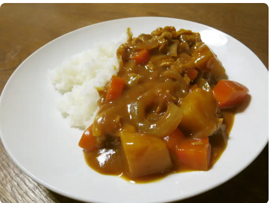
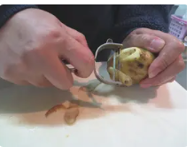
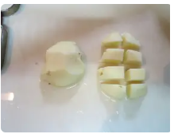
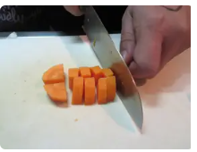
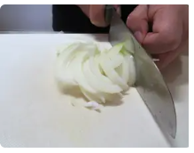
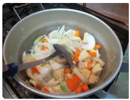
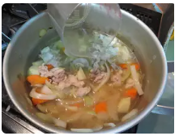
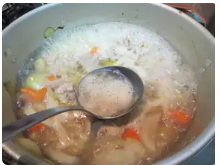
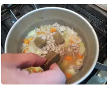
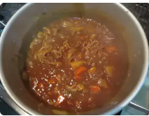

# 美味しいカレーの作り方

#　材料
：豚こま肉
２５０ｇ
・じゃがいも
２個
・にんじん
１本
・たまねぎ
２個
水
８００cc
サラダ油
大さじ１
カレールウ
半分
【隠し味】
お好みで

# 作り方
1.【道具一覧】
鍋、おたま、包丁、まな板、ピーラー、ボウル、ざる、計量スプーン、計量カップ、菜箸

2.じゃがいも、にんじんを洗う。たまねぎは、包丁で頭と根の部分を切り落とし、皮をむいて洗う。

3.ピーラーで、じゃがいも、にんじんの皮をむく。

4.じゃがいもを、半分に切ってから、一口大（６～８個）に切る。

5.にんじんを、１ｃｍ幅のイチョウ切りにする。

6.たまねぎを、薄切りにする。

7.厚手の鍋にサラダ油を熱する。材料Aを入れ、焦がさないように炒める。

8.水を加え、沸騰させる。

9.あくを取ったら、約１５～２０分煮込む。（中火）

10.火を止める。ルウを溶かしながら入れる。

11.お好みで、隠し味を入れる。
12.再び火をつける。（弱火）とろみがつくまで煮込む。完成です。
